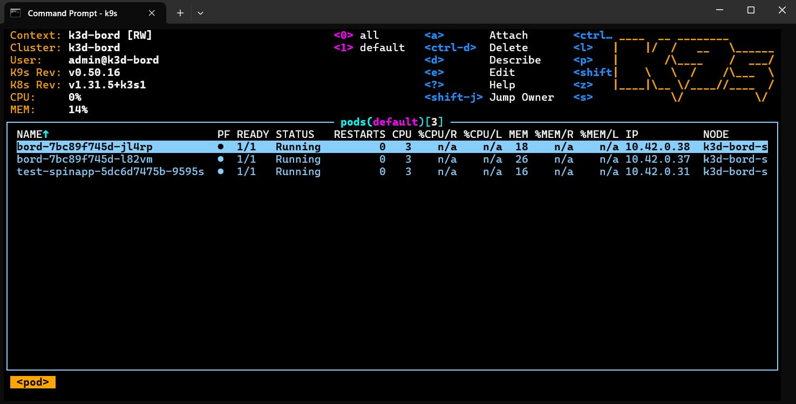

# Bord

A minimal Twitter/Threads clone built with Rust and the Spin framework.

## About

This is a fun learning project to explore Rust and the [Spin framework](https://www.fermyon.com/spin) by building a simple MVP social media platform. It demonstrates core web development concepts including HTTP routing, data persistence with KV, content filtering and more.

## Features

- Post creation and retrieval
- User authentication, user following mechanism and user feed
- Content filtering and HTML sanitization
- Built with WebAssembly (WASM) for portable, lightweight execution

## Prerequisites

- **Rust** (1.78 or later) - [Install Rust](https://www.rust-lang.org/tools/install)
- **Spin CLI** - [Install Spin](https://developer.fermyon.com/spin/install)
- **WASM Target** - Add the WebAssembly target:

  ```bash
  rustup target add wasm32-wasip1
  ```

## Getting Started

1. Clone the repository:

   ```bash
   git clone https://github.com/kul-work/bord.git
   cd bord
   ```

2. Build and run the application:

   ```bash
   spin up --build
   ```

   The application will be available at `http://localhost:3000`

3. Run tests:

   ```bash
   cargo test
   ```

## Project Structure

- `src/` - Rust source code
- `static/` - Static assets
- `tests/` - Test suite
- `Cargo.toml` - Rust project manifest
- `spin.toml` - Spin application configuration

## Spin Kube with k3d (on Windows)

1. Purge k3d

   ```bash
   k3d cluster delete --all
   docker network rm k3d-bord #just to make sure
   ```

2. Create cluster

   ```bash
   k3d cluster create --config ./.k3d/cluster-config.yaml
   ```

3. Install Spin Operator

   ```bash
   install-spin-operator.bat
   ```

4. Build and push to local registry

   ```bash
   spin build
   spin registry push --insecure localhost:5000/bord:latest
   ```

5. Deploy to k3d

   ```bash
   kubectl apply -f bord-spin.yaml
   ```

6. Check status

   ```bash
   kubectl get spinapps
   kubectl logs -f deployment/bord
   ```

   

7. Test app

   ```bash
   kubectl port-forward svc/bord-service 80:80
   start http://localhost

   ```

   ## Learning Resources

- [Spin Framework Documentation](https://developer.fermyon.com/spin)
- [Rust Book](https://doc.rust-lang.org/book/)
- [Spin Rust SDK](https://docs.rs/spin-sdk/)
- [Spin Kube](https://www.spinkube.dev/)

## License

See LICENSE file for details.
